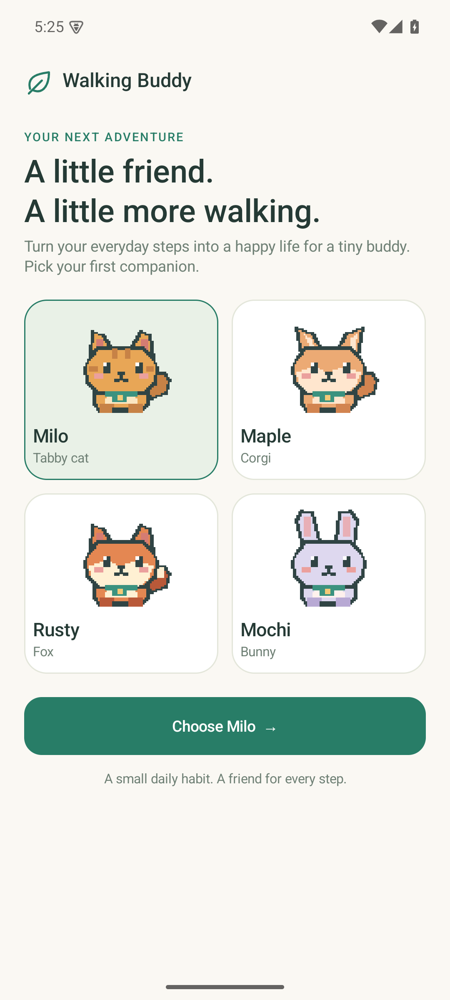
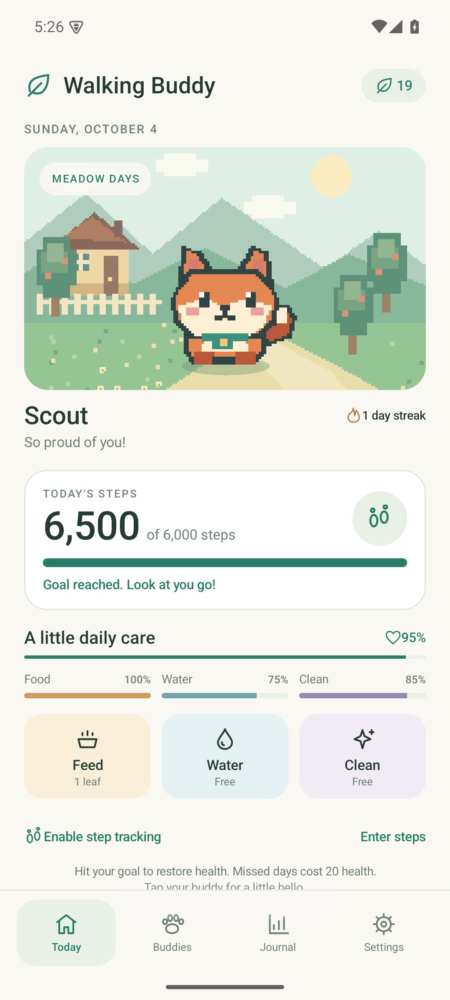
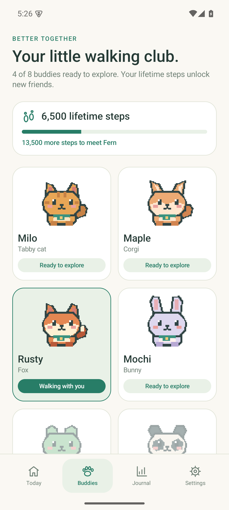
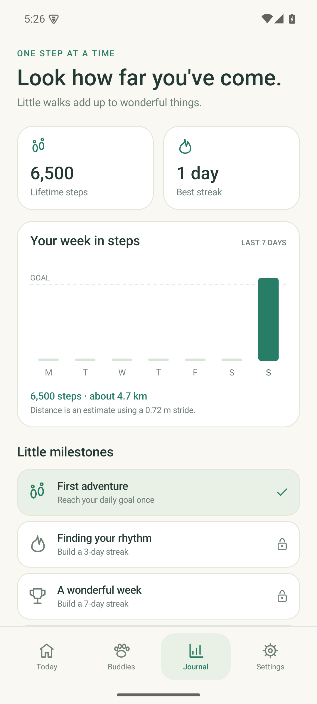
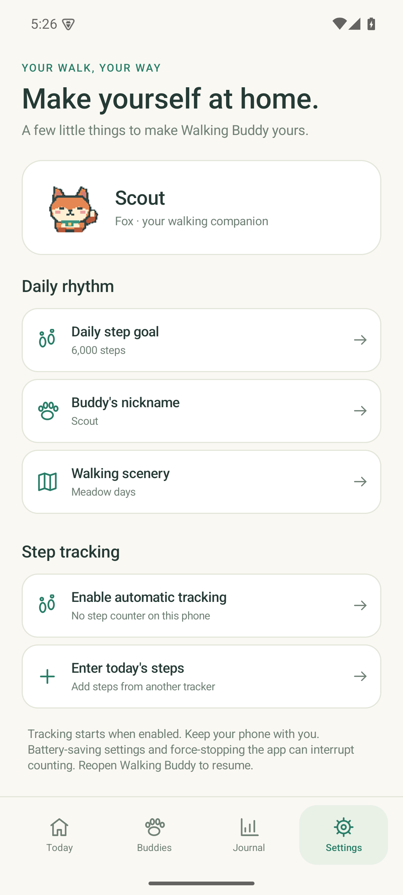

# Walking Buddy 1.0.0 verification

Verified October 4, 2026.

- Signed release APK built successfully with JDK 17, Gradle 8.11.1, AGP 8.9.1,
  compile/target SDK 35 and min SDK 26.
- `testDebugUnitTest`: **27 tests, zero failures, zero errors**.
- `lintDebug`: **zero errors**. Remaining warnings concern English-only UI text,
  programmatically constructed views, icon theming, and small draw allocations.
- Native integration runner on Android 15 / API 35, Pixel 6 arm64 emulator:
  **27 passing checks**.
- Tests covered adoption, companion choice, nickname persistence, manual input,
  combined totals, goal rewards, feeding, navigation, goal validation/editing,
  reduced animation, state serialization, and activity restart.
- Additional process stop/relaunch check confirmed the persisted nickname,
  companion, manual total, daily goal, and reduced-animation preference.
- Final `dist/Walking-Buddy-1.0.0.apk` successfully installed and launched in the
  emulator. Its label is **Walking Buddy**, application ID is
  `com.walkingbuddy.app`, and its application flags omit `DEBUGGABLE`.
- APK Signature Scheme v2 verification passed. All app code is Java bytecode;
  there are no ABI-specific native libraries, so the APK is universal.
- SHA-256 file checksum is recorded in `dist/SHA256SUMS`.
- Signing certificate SHA-256:
  `d311d35cb5a14a280ec0bffb554c2fc3f67ab71819c011b8ff1de6180441f646`.
- Visual review completed for adoption, Today, Buddies, Journal, and Settings.
  Screenshots below use explicitly entered demo steps in the isolated debug app.
  The distributable release starts with no progress.
- The emulator has no hardware `TYPE_STEP_COUNTER` sensor. Actual walking,
  background counting on a physical phone, permission grants/denials on a
  sensor-equipped phone, and OEM power-management behavior remain unverified.
  Synthetic counter delta, reboot, midnight, duplicate, and delayed-sample cases
  are covered by the deterministic tests. The sensor-absent/manual fallback was
  exercised on the emulator. Android 8–14 and Android 16 have not been device-tested.

## Screens

